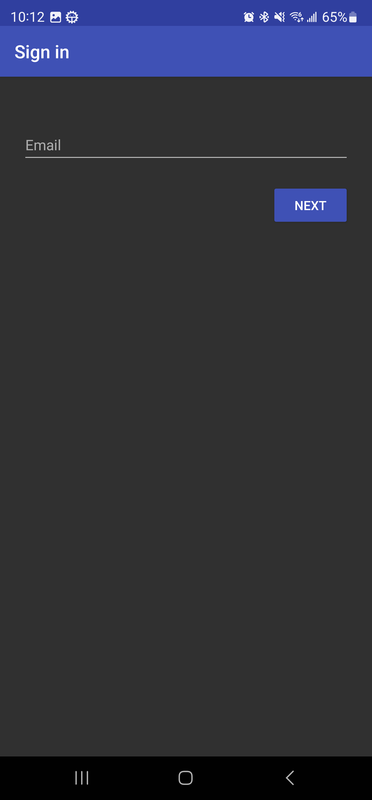
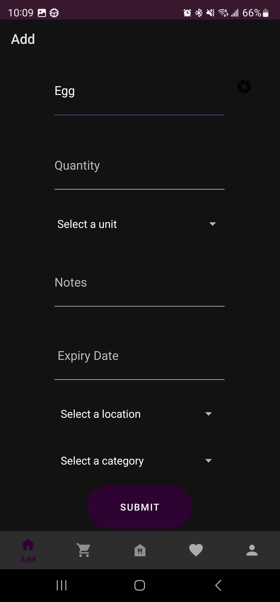
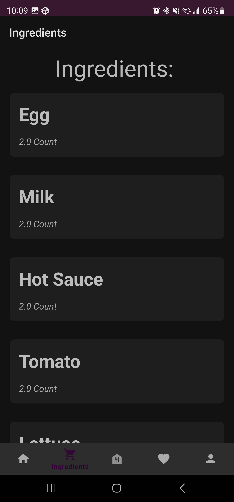
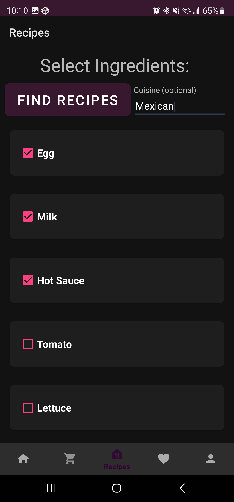
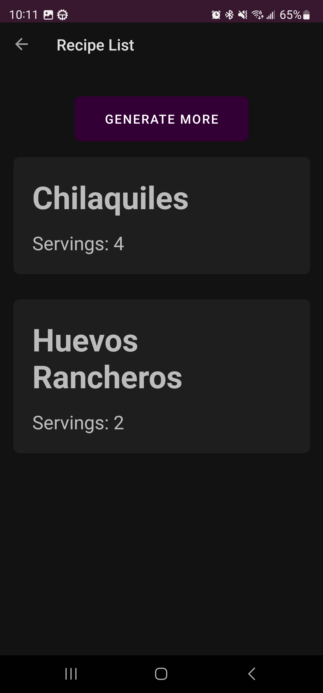
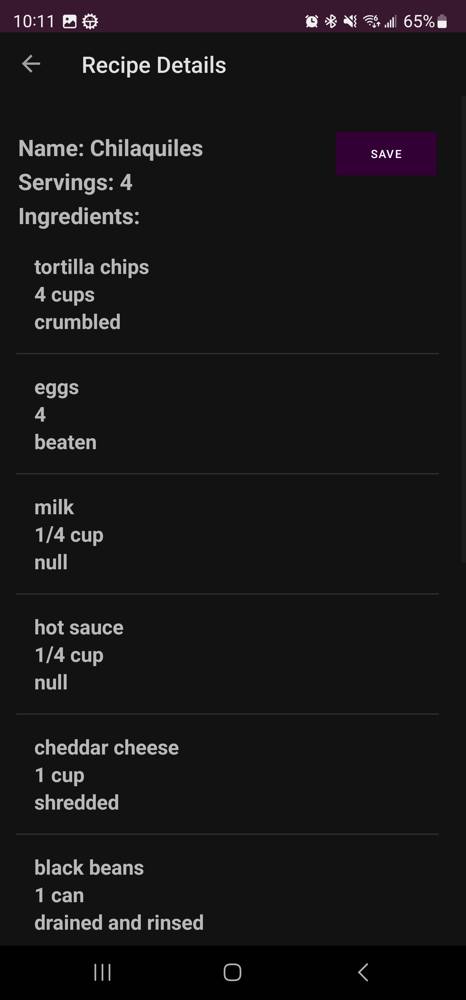
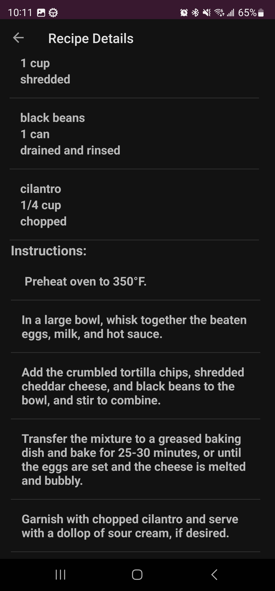
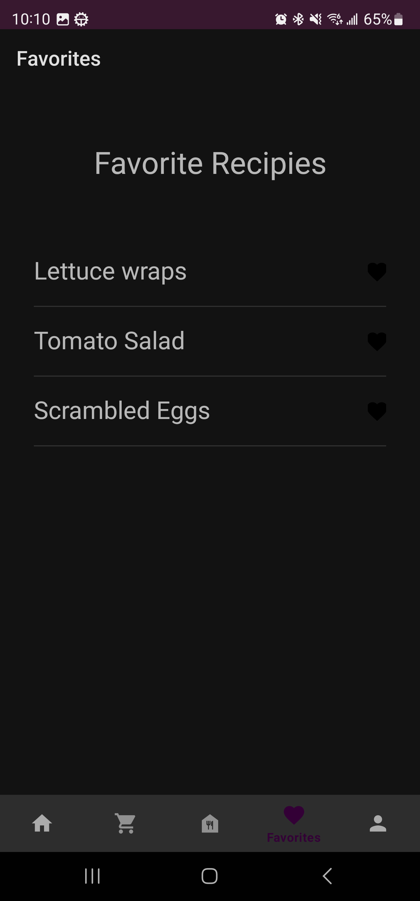
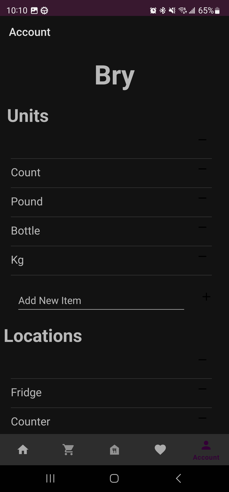

# CMPE 277 Project

<b>Course Name :</b> Smartphone App Dev

<b>Project Name  :</b> Kitchen Keeper

<b>Team Name: Three Guys </b>

<b>University Name :</b> [San Jose State University](https://www.sjsu.edu/)

<b>Professor's Name :</b> Chandrasekar Vuppalapatti

<b>Team Members:</b>  
[Hongru Lin](https://www.linkedin.com/in/hongrulin/) 

[Bryan Caldera](https://www.linkedin.com/in/bryancaldera/) 

[Blessy Dickson Daniel Moses](https://www.linkedin.com/in/blessy-dickson-348a31133/)

## Introduction
In our day to day lives we forget what ingredients we have in our refrigerator and it may end up getting spoiled. Sometimes we do not know what to cook for certain ingredients and give up on cooking. So we decided to build an Android app which is a one stop solution for tracking all the ingredients we have in our refrigerator along with the expiry date. Users can also search recipes to cook based on those ingredients.
Our app will let users sign up for an account free of cost. Users can just take a picture of the ingredient and the app will automatically recognize the ingredient using AWS AI. The user can then add that ingredient to the list and also add its expiry date. These details will be stored in the firebase cloud database.The user can view a list of ingredients added to the list. The user can also search for recipes based on one or multiple ingredients and a cuisine, the app will return a list of recipes and the user can select a particular recipe and start cooking. The user can also save favorite recipes for viewing later. The app also has a profile page where users can customize the app by adding their own units and locations.

## Technologies used
Language:Java  
Firebase authentication and storage  
AWS Rekognition  
OPEN AI API-Chatgpt 3.5

## User manual
* Create an account using email and password. 
* Add ingredients by entering ingredient name or capturing a picture of the ingredient and entering details like units,categories, location,expiration date and notes is optional. 
* View the ingredients added in the ingredient list page. 
* Search for recipes by selecting the ingredients and entering a cuisine and then selecting generate recipes. 
* Save the favorite recipes and view them on the favorites tab. 
* Users can also remove ingredients on the ingredient list page. 
* In the profile page, users can customize their app by adding or removing units and locations. 
* The user can also switch accounts or logout on the profile page. 

## Sample Demo screenshots
Sign in page:

Add ingredient page:

Ingredient image recognition: 

Ingredients list: 

Find recipes:

Recipe list:

Recipe details:

Favorites:

Profile:

